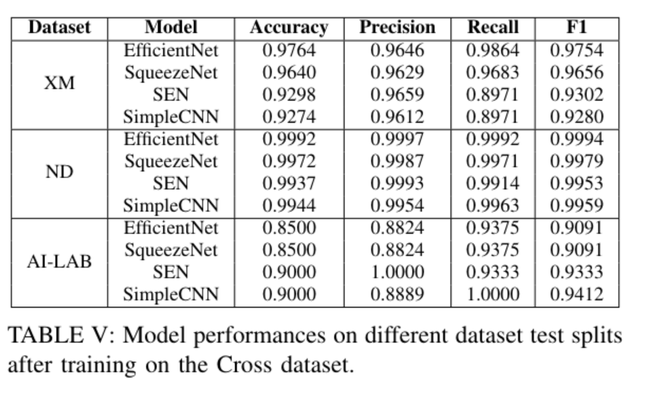

# Project

Plant diseases have a huge impact on the agriculture industry by causing substantial yield losses, threatening farmer livelihoods and may therefore pose a threat to food security. Other usages include hobby gardeners or home owners with plants to check for diseased plants. A variety of techniques have been used in recent years to tackle this problem, including more traditional computer vision techniques like edge-detection or clustering as well as machine learning using CNNs or SVMs. This project aims to explore different machine learning techniques, architectures and their influence on a model performance including pre-processing, cross-dataset learning, hyper-parameter tuning, pre-trained model fine-tuning using different sized models for a **binary classification of diseased plant leaves**.


* The training implementation can be found in the [project.ipynb](./project.ipynb) file.
* Our trained models end with *.pth*
* You can try a demo [here](https://plant-ai.lr-projects.de/). Read more in the [server](#server-for-the-fun-of-it) section.


## Gettings started

### Install dependencies:

* Required python version: `<3.13,>=3.10`
* Install dependencies with poetry from the root dir of this repo:
```
pip install poetry
poetry install
```


### Add Kaggle API-Key

1. Add Kaggle API-Key
    1. Go to your [Kaggle Account](https://www.kaggle.com/settings)
    2. Under API click *Create New Token*
    3. Add the downloaded file under `~/.kaggle/kaggle.json` on Linux, OSX, and other UNIX-based operating systems, and at `C:\Users\<Windows-username>\.kaggle\kaggle.json` on Windows

2. Run the [project.ipynb](./project.ipynb) notebook

## Datasets:

The original dataset and the cross dataset learning dataset in comparision:


<cite>Samir Bhattarai. New Plant Diseases Dataset. https://www.kaggle.com/datasets/vipoooool/new-plant-diseases-dataset, 2018. Kaggle.</cite>

|Dataset                  | num images | num healthy leaves (0) | num diseased leaves (1) | num leave types | image size | num disease types|
|-------------------------|------------|------------------------|-------------------------|-----------------|------------|------------------|
| **Computer Vision (XM)**| 4235       | 2129                   | 2107                    | 10              | 6000x4000  | -                |
| **New Plant Diseases (ND)**  | 87667      | 27866                  | 59801                   | 14              | 256x256    | ~ 24             |
| **KI-Lab**  | 20      | 4                  | 16                   | 9              | -    | -             |

Both dataset focus on disease detection for use in the agriculture industry as stated by the original dataset:

<cite>Crop diseases are a major threat to food security, but their rapid identification remains difficult in many parts of the world due to the lack of the necessary infrastructure. </cite>

and the New Plant Disease dataset:

<cite>Plant diseases are not only a threat to food security at the global scale, but can also have disastrous consequences for smallholder farmers whose livelihoods depend on healthy crops</cite>

The following plant types are included:

| **Computer Vision - XM** | **New Plant Diseases** |
|--------------------------|------------------------|
| Alston Scholaris                         | Apple
| Arjun | Blueberry
| Chinar | Cherry
| Gauva | Corn
| Jamun | Grape
| Jatropha | Orange
| Lemon | Peach
| Mango | Bell Peper
| Pomegranate | Potato
| Pongamia Pinnata | Raspberry
|  | Soybean
|  | Squasch
|  | Strawberry
|  | Tomato

The New Plant Diseases dataset was selected as the original dataset to be enhanced does not contain any references to the type of disease to be found in the data, as well as having a set of relativly unkown plant types. During to search for fitting dataset only plant specific dataset for one or two of the present plant types could be found. Therfore the New Plant Diesease dataset was selected instead with no overlapping plant types but a big variaty of diseases present. The image data is not of as high of a quality as the original dataset but the all leaves are taken on a darker background, and are therefore relativly similar to the original data. The goal is to create a more generalised model that predicts if a leave is healthy or diseased even if the type of plant or plant/disease relationship was not present in the dataset.


## Results




These are the final results when training EfficientNet 0B, SqueezeNet 1.1, SEN and SimpleCNN on both datasets and validating them on a test split of each dataset that was never seen during training.

## Server for the fun of it

To try out if the models work under real circumstances, a small python server can be found under [server.py](./server.py) that serves a simple HTML page and runs the models in the backend. Simply take an image when opening the website on your phone or uplaod an image when opening it on a desktop.

Access the demo under: https://plant-ai.lr-projects.de

### How to use it locally

To upload your own images or use the camera on your phone you can start the webserver with this command from the project directory:

```bash
python -m uvicorn server:app
```

 Open http://localhost:8080 to upload your own images and get a result.

In Docker:

1. Build: ```docker build -t lrprojects/plant-disease-ai:latest .```
2. (Optional) Push: ```docker push lrprojects/plant-disease-ai:latest```
3. Run ```docker run -p 8000:8000 lrprojects/plant-disease-ai:latest```


